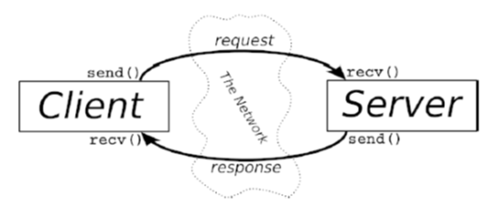

# 6. Client-Server 基礎

寶貝，這是個 client-server（客戶端-伺服端）世界。單純與網路處理 client process（客戶端行程）及 server process（伺服端行程）溝通的每件事情有關，反之亦然。以 telnet 為例，當你用 telnet（client）連線到遠端主機的 port 23 時，主機上的程式（稱為 telnetd server）就開始動了起來，它會處理進來的 telnet 連線，並幫你設定一個登入提示字元等。

Client 與 server 間的訊息交換摘錄於上列的流程圖中。

需要注意的是 client-server pair 可以使用 SOCK\_STREAM、SOCK\_DGRAM 或其它的（只要它們用一樣的協定來溝通）。有一些不錯的 client-server pair 範例，如：telnet/telnetd、ftp/ftpd 或 Firefox/Apache。每次你使用 ftp 時，都會有一個 ftpd 遠端程式來為你服務。

一台機器上通常只會有一個 server，而該 server 會利用 fork()來處理多個 clients。基本的機制（routine）是：server 會等待連線、accept() 連線，並且 fork() 一個 child process（子行程）來處理此連線。這就是我們在下一節的 server 範本所做的工作。
